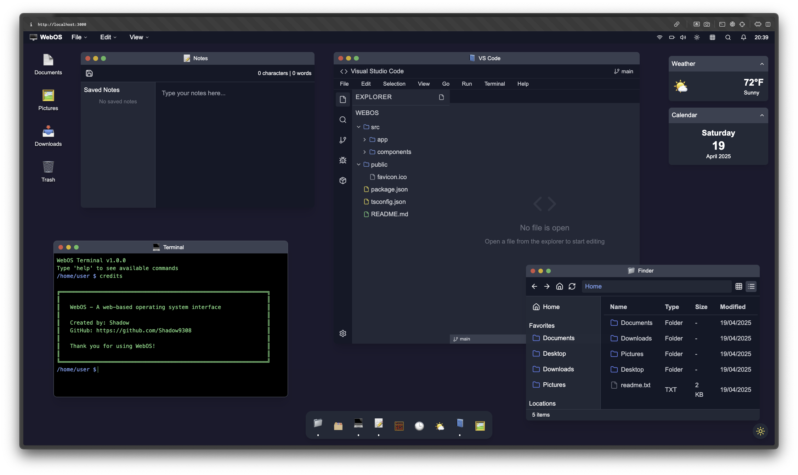

# macOS Web

**Simulate the macOS desktop experience right in your browser.**  
This open-source project brings the look and feel of macOS to the web — with real, interactive components like Terminal, Code Editor, customizable Wallpapers, and more.

 <!-- Replace with actual preview image path -->

---

## ✨ Features

- 🖥️ **Full Desktop UI** – A responsive macOS-style desktop environment built with Svelte and Vite.
- 💻 **Web Terminal** – Run simulated UNIX-style commands directly in-browser.
- 🔎 **Spotlight Search** - Use spotlight for easy access to all your apps. 
- 🧠 **In-Browser Code Editor** – Tinker with the source code of this very project or fork it to build your own.
- 🎨 **Dynamic Wallpapers** – Choose from built-in wallpapers or set your own custom background.
- 🧩 **Modular App Framework** – Easily plug in new "apps" like Notes, Finder, or anything you want.
- 🔧 **Dev-First** – Made with developers in mind, for learning, experimenting, or just geeking out.

---
## ⚠️ Known Issues 

### UI
VSCode is not up to date with current source code (19/04/25)

### 

---

## 🚀 Installation

### Clone the Repo

```bash
git clone https://github.com/Shadow9308/webOS.git
cd webOS
npm install 
npm run dev
